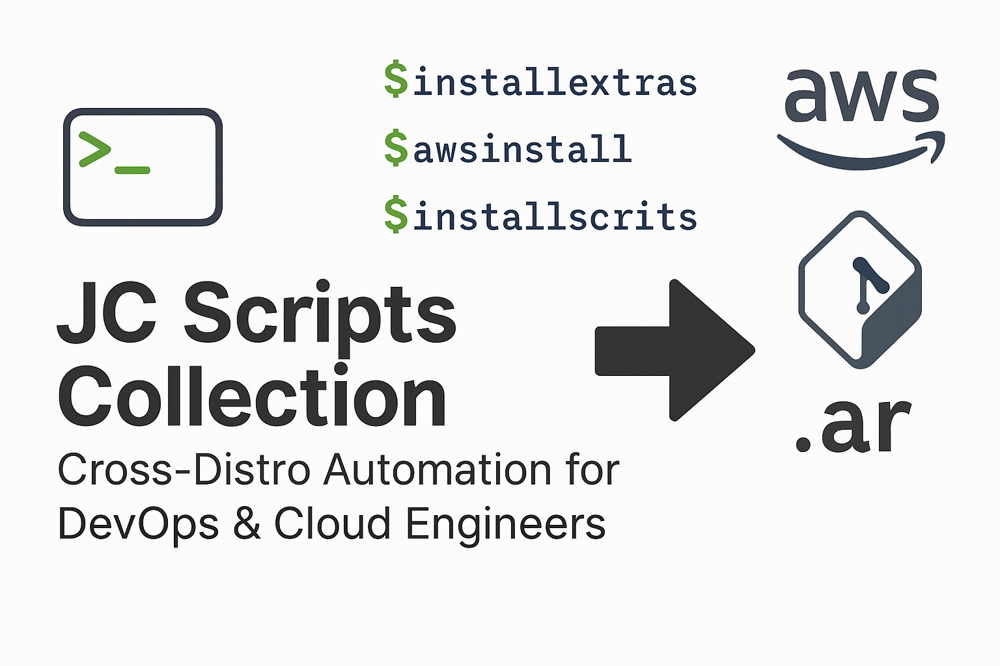

# JC Scripts Collection

I hope you enjoy this collection of useful scripts! This repository contains
various Bash scripts designed to simplify tasks, enhance productivity,
and streamline workflows.

## Table of Contents

- [Overview](#overview)
- [Prerequisites](#Prerequisites)
- [Installing AWS CLI](#Installing-AWS-CLI)
- [Getting Started](#getting-started)
- [Configurations](#configurations)
- [Available Scripts](#available-scripts)
- [Libraries](#libraries)
- [Contributing](#contributing)
- [License](#license)

---
## Overview

>This repository includes scripts that automate tasks such as AWS profile
management, device handling, and more. The scripts are organized into a
compact library file (`scripts.ar`) to make distribution easy and
efficient. Each script is documented and designed for ease of use,
customization, and flexibility.

---
## Prerequisites
> Before using this repository, make sure your environment meets the following requirements:

1. **Linux Operating System**

    Compatible with most Linux distributions (e.g., Ubuntu, Fedora, Debian, Arch, Alpine).

2. **Quick Installation**

    For a quick and automated setup, use the provided helper scripts:

    ```bash
    ./installextras    # Install all required tools automatically
    ./awsinstall       # Install AWS CLI (for AWS scripts)
    ```

3. **Manual Installation** (if needed)

    If you prefer to install tools manually, the following are required:

- git
    > For cloning the repository and version control.

    ```bash
    sudo apt install git        # Debian/Ubuntu-based systems
    sudo dnf install git        # Fedora-based systems
    sudo pacman -S git          # Arch-based systems
    sudo apk add git            # Alpine
    ```
- ar 
    > Utility: Used for creating the scripts library (scripts.ar).

    ```bash
    sudo apt install binutils   # Debian/Ubuntu-based systems
    sudo dnf install binutils   # Fedora-based systems
    sudo pacman -S binutils     # Arch-based systems
    sudo apk add binutils       # Alpine
    ```
- Bash Shell
    >  Required to run the scripts. This is pre-installed on most Linux distributions.

- curl & unzip
    > Required for the one-liner installation method and AWS CLI installation.

    #### Installing `curl` and `unzip`:
    - **Ubuntu/Debian-Based Systems**:
      ```bash
      sudo apt update
      sudo apt install curl unzip -y
      ```
    - **Fedora/Red Hat-Based Systems**:
      ```bash
      sudo dnf install curl unzip -y
      ```
    - **Arch-Based Systems**:
      ```bash
      sudo pacman -S curl unzip
      ```
    - **Alpine Linux**:
      ```bash
      sudo apk add curl unzip
      ```

4. **AWS CLI Installation**

    For users who need AWS scripts functionality, AWS CLI must be installed.
    Use the provided script for automatic installation:

    ```bash
    ./awsinstall    # Automatic installation for any Linux distribution
    ```

    Or install manually following the [Installing AWS CLI](#Installing-AWS-CLI) section below.

## Prerequisites for Alpine Linux
>In addition to the general prerequisites for this project, users running Alpine Linux should ensure the following packages are installed:

### Required Packages
1. file: 
    >Required for proper script detection.

    ```bash
        sudo apk add file
    ```

2. Other Essential Tools (if not already installed)

    - bash (All scripts require Bash by default):

        ```bash
        sudo apk add bash
        ```
    - findutils: To use a full-featured version of find.

        ```bash
        sudo apk add findutils
        ```
3. Optional Tools:

    - column: For nicely formatted script lists (used with the -s option in the scripts command):

        ```bash
        sudo apk add util-linux
        ```

### Installing AWS CLI
>AWS CLI allows users to interact with AWS services directly from the command line.

#### Quick Method (Recommended)

Use the provided `awsinstall` script which automatically detects your OS and installs AWS CLI:

```bash
./awsinstall
```

This script:
- Detects your Linux distribution automatically
- Offers official AWS installer (recommended) or package manager installation
- Handles all prerequisites
- Works on Ubuntu, Debian, Fedora, RHEL, Arch, and Alpine Linux

#### Manual Installation by Distribution

If you prefer manual installation, follow the instructions for your specific distribution:

#### For Ubuntu and Debian-Based Systems

**Recommended Method (Official AWS Installer):**

1. Download and install AWS CLI v2:

    ```bash
    curl "https://awscli.amazonaws.com/awscli-exe-linux-x86_64.zip" -o "awscliv2.zip"
    unzip awscliv2.zip
    sudo ./aws/install
    rm -rf aws awscliv2.zip
    ```

2. Verify the installation:

    ```bash
    aws --version
    ```

**Alternative Method (apt package manager):**

> ⚠️ **Note**: The apt package may provide an older version. The official installer above is recommended.

```bash
sudo apt update
sudo apt install awscli -y
aws --version
```
#### For Fedora and Red Hat-Based Systems

**Recommended Method (Official AWS Installer):**

1. Download and install AWS CLI v2:

    ```bash
    curl "https://awscli.amazonaws.com/awscli-exe-linux-x86_64.zip" -o "awscliv2.zip"
    unzip awscliv2.zip
    sudo ./aws/install
    rm -rf aws awscliv2.zip
    ```

2. Verify the installation:

    ```bash
    aws --version
    ```

**Alternative Method (dnf package manager):**

> ⚠️ **Note**: The dnf package may provide an older version. The official installer above is recommended.

```bash
sudo dnf install awscli -y
aws --version
```
#### For Arch-Based Systems

**Recommended Method (Official AWS Installer):**

1. Download and install AWS CLI v2:

    ```bash
    curl "https://awscli.amazonaws.com/awscli-exe-linux-x86_64.zip" -o "awscliv2.zip"
    unzip awscliv2.zip
    sudo ./aws/install
    rm -rf aws awscliv2.zip
    ```

2. Verify the installation:

    ```bash
    aws --version
    ```

**Alternative Method (pacman package manager):**

```bash
sudo pacman -S aws-cli
aws --version
```
#### For Alpine Linux

**Recommended Method (Official AWS Installer):**

1. Install prerequisites and AWS CLI v2:

    ```bash
    sudo apk add --no-cache curl unzip groff less
    curl "https://awscli.amazonaws.com/awscli-exe-linux-x86_64.zip" -o "awscliv2.zip"
    unzip awscliv2.zip
    sudo ./aws/install
    rm -rf aws awscliv2.zip
    ```

2. Verify the installation:

    ```bash
    aws --version
    ```

**Alternative Method (apk package manager):**

> ⚠️ **Note**: The apk package may not always be available or up-to-date. The official installer above is recommended.

```bash
sudo apk add aws-cli
aws --version
```
#### Manual Installation
>Alternatively, users can manually download and install AWS CLI by following the [official AWS documentation.](https://docs.aws.amazon.com/cli/latest/userguide/getting-started-install.html)


## Getting Started

### Quick Installation (Recommended)

The easiest way to set up the JC Scripts Collection is to use the automated installation scripts:

1. Clone the repository:

   ```bash
   git clone https://github.com/jcgarcia/jcscripts.git
   mv jcscripts ~/.scripts && cd ~/.scripts
   ```

2. Install all prerequisites automatically:

   ```bash
   ./installextras
   ```
   
   This script will:
   - Detect your Linux distribution (Ubuntu, Debian, Fedora, RHEL, Arch, Alpine)
   - Install all required tools (git, binutils, util-linux, ncurses, jq, curl, unzip)
   - Install distribution-specific packages (Alpine gets bash, file, findutils, etc.)
   - Verify all installations

3. Run the setup script:

   ```bash
   ./installscripts
   ```
   
   This script will:
   - Extract scripts from the scripts.ar library
   - Make all scripts executable
   - Fix line endings (CRLF to LF)
   - Update your PATH to include ~/.scripts

4. (Optional) Install AWS CLI for AWS-related scripts:

   ```bash
   ./awsinstall
   ```
   
   This script will:
   - Detect your Linux distribution
   - Offer official AWS installer (recommended) or package manager installation
   - Handle all prerequisites automatically
   - Verify the installation

5. Reload your shell configuration:

   ```bash
   source ~/.bashrc  # or source ~/.profile for Alpine
   ```

6. You can now use any script directly:

   ```bash
   awslogin          # AWS SSO login
   wslops            # WSL operations
   scripts           # List all available scripts
   ```

### Keeping Your Scripts Updated

To update your scripts to the latest version from the repository:

```bash
scripts -u
# or
scripts --update
```

This will:
- Check if updates are available by comparing versions
- Show you the current vs. latest version
- Ask for confirmation before updating
- Download and install the latest scripts automatically
- Preserve your configuration files

**Note:** The update feature requires an internet connection and will use the `installscripts` process to ensure a clean update.
   ```

### Manual Installation Steps

### Manual Installation Steps

If you prefer manual installation or need more control:

1. Clone the repository:

   ```bash
   git clone https://github.com/jcgarcia/jcscripts.git
   mv jcscripts ~/.scripts && cd ~/.scripts
   ```

2. Install prerequisites manually (see [Prerequisites](#prerequisites) section)

3. Run the setup script:

3. Run the setup script:

   ```bash
   ./installscripts
   ```

4. The setup script will:
   - Verify that all required components are present
   - Extract scripts from the scripts.ar library
   - Make valid shell scripts executable
   - Fix any line ending issues
   - Add the .scripts directory to your PATH

5. After installation, reload your shell and run scripts directly:

5. After installation, reload your shell and run scripts directly:

   ```bash
   source ~/.bashrc
   script_name
   ```

### Alternative: One-Liner Installation

For a completely automated installation without cloning first:

```bash
bash <(curl -sSL https://raw.githubusercontent.com/jcgarcia/jcscripts/main/installscripts)
```

> **Note**: This method automatically clones the repository, but you'll still need to run `./installextras` and optionally `./awsinstall` afterwards for full functionality.

## Installation Scripts

The repository includes four helper scripts to make installation bullet-proof on any Linux distribution:

### `installextras` - Install Prerequisites

Automatically detects your OS and installs all required packages.

**What it does:**
- Detects Linux distribution (Ubuntu, Debian, Fedora, RHEL, CentOS, Arch, Alpine)
- Installs core tools: git, binutils (ar), util-linux (column), ncurses (tput)
- Installs JSON and download tools: jq, curl, unzip
- Installs xdg-utils (xdg-open) for browser integration
- For Alpine: Also installs bash, file, findutils, groff, less
- Verifies all installations and shows status

**Usage:**
```bash
./installextras           # Install all prerequisites
./installextras -h        # Show help
./installextras -v        # Show version
```

**Supported distributions:** Ubuntu, Debian, Fedora, RHEL, CentOS, Rocky, AlmaLinux, Arch, Manjaro, Alpine

### `awsinstall` - Install AWS CLI

Automatically detects your OS and installs AWS CLI v2 using the best method.

**What it does:**
- Detects your Linux distribution
- Offers official AWS installer (recommended for latest version)
- Falls back to package manager if needed
- Installs prerequisites (curl, unzip) if missing
- Verifies installation and shows version
- Handles updates and reinstalls

**Usage:**
```bash
./awsinstall              # Install AWS CLI with prompts
./awsinstall -h           # Show help
./awsinstall -v           # Show version
```

**Installation methods:**
- **Option 1** (Recommended): Official AWS installer - Always latest version
- **Option 2**: Package manager - May be older but simpler

### `browserinstall` - Install Firefox Browser

Automatically detects your OS and installs Firefox if no browser is found.

**What it does:**
- Scans for existing browsers (Chrome, Chromium, Firefox, Edge, Opera, Brave, etc.)
- Detects your Linux distribution
- Installs Firefox using the appropriate package manager
- Verifies installation and shows version
- Provides guidance for X11 forwarding setup

**Usage:**
```bash
./browserinstall          # Install Firefox if no browser exists
./browserinstall -f       # Force install Firefox
./browserinstall -h       # Show help
./browserinstall -v       # Show version
```

**Supported distributions:** Ubuntu, Debian, Fedora, RHEL, CentOS, Rocky, AlmaLinux, Arch, Manjaro, Alpine, openSUSE

**Note:** After installing a browser on a headless server, you'll need X11 forwarding to use it. See the `setupX11Forwarding` script.

### `installscripts` - Setup Repository

Extracts and configures all scripts from the repository.

**What it does:**
- Clones/updates the repository if needed
- Checks for required prerequisites
- Extracts scripts from the scripts.ar library
- Makes all scripts executable
- Fixes line endings (CRLF → LF) automatically
- Updates your PATH configuration
- Creates configuration files

**Usage:**
```bash
./installscripts          # Run setup
./installscripts -h       # Show help
./installscripts -v       # Show version
```

> **Tip**: Run `./installextras` first to ensure all prerequisites are installed.

## Recommended Installation Order

For the smoothest experience, follow this order:

```bash
# 1. Clone repository
git clone https://github.com/jcgarcia/jcscripts.git && cd jcscripts

# 2. Install all prerequisites
./installextras

# 3. Setup scripts
./installscripts

# 4. (Optional) Install AWS CLI for AWS features
./awsinstall

# 5. Reload shell
source ~/.bashrc
```

## One-Liner Installation

To quickly install the JC Scripts Collection, run the following command:

## One-Liner Quick Install

For experienced users who want the fastest setup:

```bash
bash <(curl -sSL https://raw.githubusercontent.com/jcgarcia/jcscripts/main/installscripts)
```

> **Note**: After this completes, run `./installextras` and `./awsinstall` for full functionality.

## Working with Headless/Remote Servers

### AWS SSO Authentication on Remote Servers

AWS SSO authentication requires a web browser. When working on headless or remote servers, you have two options:

#### Option 1: SSH Tunnel (Recommended for Quick Use)

The `awslogin` script automatically detects remote SSH sessions and provides complete instructions for creating an SSH tunnel. Simply run:

```bash
awslogin
```

The script will display:
- The exact SSH tunnel command to run from your local machine
- The authentication URL to open in your local browser
- Real-time status updates as you complete authentication

#### Option 2: X11 Forwarding (Recommended for Regular Use)

For a seamless experience where the browser opens automatically on your local machine, set up X11 forwarding once:

**One-time setup on the remote server:**

```bash
sudo setupX11Forwarding
```

This script will:
- Install required X11 packages (xauth, xorg, x11-apps)
- Configure SSH daemon for X11 forwarding
- Set up proper permissions and environment
- Provide test applications (xeyes, xclock, xcalc)

**Connect from your local machine with X11 forwarding:**

```bash
ssh -X user@server          # Basic X11 forwarding
ssh -XC user@server         # With compression (recommended for slow connections)
```

**Verify X11 is working:**

```bash
echo $DISPLAY              # Should show: localhost:10.0
xeyes                      # Test with a simple GUI app
```

**Then use awslogin normally:**

```bash
awslogin                   # Browser opens automatically on your local machine
```

**Client-side X11 Server Requirements:**

- **Linux**: Usually pre-configured, no additional setup needed
- **macOS**: Install XQuartz: `brew install --cask xquartz`
- **Windows**: Install VcXsrv, MobaXterm, or Xming

**Optional: Create SSH config for convenience (~/.ssh/config on local machine):**

```bash
Host myserver
    HostName server-ip-or-hostname
    User your-username
    ForwardX11 yes
    ForwardX11Trusted yes
    Compression yes

# Then connect with: ssh myserver
```

---

## Configurations

The `.jcscripts` file contains configuration options for the scripts repository. Below are the configurable values:

- **EDITOR**: Specifies the text editor for editing scripts (default: `vi`).
- **SCRIPTS_DIR**: Defines the directory where the scripts will be stored (default: `~/.scripts`).
- **SSH_KEY**: Path to the SSH key for accessing GitHub (default: `~/.ssh/personalkey.pem` you must generate your own key and change that in the config file).

### Generating an SSH Key

To generate your own SSH key:

1. Run the provided script, and follow the prompts to create the key.
  
```bash
   ./generate_ssh_key
```


2. Follow the prompts to create the key.


- Copy the contents of the public key file (~/.ssh/personalkey.pem.pub):

```bash
cat ~/.ssh/personalkey.pem.pub
```
- Log in to GitHub and navigate to Settings > SSH and GPG Keys > New SSH Key.
[Adding a new SSH key to your GitHub account](https://docs.github.com/en/authentication/connecting-to-github-with-ssh/adding-a-new-ssh-key-to-your-github-account?form=MG0AV3)


- Paste the contents into the Key field, give it a meaningful title, and save.


Example .jcscripts file:

```bash

# Configuration for scripts
EDITOR="vi"
SCRIPTS_DIR="~/.scripts"
```
## Available Scripts

Here are all the scripts included in this repository:

### Installation & Setup Scripts

- **installextras**: Automatically detects OS and installs all required extra packages and tools for any Linux distribution.
- **awsinstall**: Automatically detects OS and installs AWS CLI using the appropriate method (official installer or package manager).
- **installscripts**: Automates the installation and setup of scripts from the repository (extraction, permissions, PATH).
- **installbackup**: Interactive wizard to configure automated backups with local, NAS, and cloud storage support (Dropbox via rclone).

### AWS Management Scripts

- **awslogin**: Dynamically sets AWS default profile after SSO login with account/role selection.
  - **Remote/Headless Servers**: Supports SSH sessions with automatic tunnel instructions for browser-based authentication
  - **GUI Servers**: Automatically opens browser for authentication
  - **X11 Forwarding**: For headless servers, you can set up X11 forwarding to use the local browser (see `setupX11Forwarding`)
- **awsaccess**: Manage AWS Identity Center operations like users and groups.
- **awsaddprofile**: Interactively add new AWS profiles and validate login.
- **awsmoveaccount**: Move AWS accounts between organizational units.
- **awsnewaccount**: Create a new AWS account, wait for creation, and verify membership in the organization.
- **createawsaccount**: Creates new AWS accounts in an organization and monitors the creation process until completion.
- **awsorg**: Fetch and display AWS Organization layout in multiple formats.
- **awsres**: Dynamically retrieve AWS resource information.
- **CreateOrganization**: Creates AWS Organizational Units and manages their structure.
- **createOrgAdm**: Automates the creation of an organization administrator profile.
- **connecttoaws**: Automate AWS connection processes.
- **getamiinfo**: Fetch and display information about AWS AMIs (Amazon Machine Images).
- **listownamis**: Lists owned AMIs for your AWS account.

### WSL & System Scripts

- **wslops**: WSL operations for your distros (install, remove, backup, restore).
- **device**: Dynamically list, mount, and unmount devices, including WSL-mounted drives.
- **setupX11Forwarding**: Configures X11 forwarding on Ubuntu headless servers for GUI applications over SSH (required for AWS SSO browser authentication on remote servers).
- **browserinstall**: Automatically installs Firefox browser if no browser is detected on the system (supports Ubuntu, Debian, Fedora, RHEL, Arch, Alpine, openSUSE).

### Cloud Platform Scripts

- **azlogin**: Log in to Azure using the Azure CLI, with optional tenant or subscription.
- **ocires**: Manage Oracle Cloud Infrastructure (OCI) resources.

### Development & Utility Scripts

- **createscripts**: Initialize a Git repository for scripts and push to GitHub.
- **edit**: Edit an existing script or create one if it doesn't exist.
- **scripts**: Lists all available scripts in the .scripts directory. Use `-u` or `--update` to check for and install updates from the repository.
- **auto-installer**: One-liner installation script for the JC Scripts Collection.

### Backup & Recovery Scripts

- **installbackup**: Configure automated backups with local, NAS, and cloud storage
  - **Interactive setup**: Wizard-based configuration for each backup
  - **Multi-backup support**: Configure backups for docs, scripts, photos, etc.
  - **Retention policy**: Keeps last 10 local backups automatically
  - **NAS synchronization**: Optional network storage sync
  - **Cloud integration**: Upload to Dropbox via rclone
  - **Automated scheduling**: Daily cron jobs with anacron for missed backups
  - **Manual commands**: `mybackup`, `myrestore`, `listbackups`, `cleanbackups`

For detailed instructions on using each script, run `<script-name> -h` or refer to the comments at the beginning of each script file.

---

## Script Usage Examples

### Installation Scripts

```bash
# Install all prerequisites for your Linux distribution
./installextras

# Install AWS CLI (auto-detects your OS)
./awsinstall

# Install Firefox browser if none is installed
./browserinstall

# Setup the repository
./installscripts
```

### AWS Scripts

```bash
# Login to AWS SSO and select profile
awslogin

# For headless/remote servers, awslogin provides SSH tunnel instructions
# Alternatively, set up X11 forwarding and browser (one-time setup):
sudo ./browserinstall      # Install Firefox if no browser exists
sudo ./setupX11Forwarding  # Configure X11 forwarding

# After X11 setup, connect with X11 forwarding:
ssh -X user@server
# Then run awslogin normally - browser opens on local machine

# Manage AWS Identity Center
awsaccess -h

# Display AWS Organization structure
awsorg

# Create new AWS account
createawsaccount
```

### WSL Scripts

```bash
# List all available scripts
scripts

# Edit a script (creates if doesn't exist)
edit myscript

# Mount/unmount devices
device
```

### Backup Scripts

```bash
# Configure automated backups (interactive)
installbackup

# After configuration, use these commands:
mybackup              # List configured backups
mybackup docs         # Run backup-docs manually
myrestore docs        # Restore docs from cloud
listbackups           # View all available backups
cleanbackups          # Remove empty/corrupted backups

# Example workflow:
installbackup         # Setup backup for ~/docs
# Configure: source, local dest, NAS, Dropbox, schedule
# Creates: backup-docs, restore-docs, cron job, anacron entry
```

---

## Libraries

### `colorfunctions`

The `colorfunctions` library provides functions for colorized output using `tput`. It includes functions to print messages in standard and bright colors.

#### Functions

- **Standard Colors**:
  - `printred`: Print a message in red.
  - `printgreen`: Print a message in green.
  - `printyellow`: Print a message in yellow.
  - `printblue`: Print a message in blue.
  - `printmagenta`: Print a message in magenta.
  - `printcyan`: Print a message in cyan.
  - `printwhite`: Print a message in white.

- **Bright Colors**:
  - `printbrightblack`: Print a message in bright black (dark gray).
  - `printbrightred`: Print a message in bright red.
  - `printbrightgreen`: Print a message in bright green.
  - `printbrightyellow`: Print a message in bright yellow.
  - `printbrightblue`: Print a message in bright blue.
  - `printbrightmagenta`: Print a message in bright magenta.
  - `printbrightcyan`: Print a message in bright cyan.
  - `printbrightwhite`: Print a message in bright white.

### `wslfunctions`

The `wslfunctions` library provides functions to manage WSL (Windows Subsystem for Linux) distributions.

#### Functions

- `convert_to_windows_path`: Convert a Linux path to a Windows path.
- `get_wsl_path`: Get the path to the `wsl.exe` executable.
- `get_powershell_path`: Get the path to the `powershell.exe` executable.
- `list_distributions`: List all WSL distributions.
- `list_online_numbered_distributions`: List available WSL distributions online.
- `install_distro`: Install a WSL distribution.
- `list_mumbered_installed_distributions`: List installed WSL distributions with numbers.
- `is_distro_running`: Check if a WSL distribution is running.
- `terminate_distro`: Terminate a running WSL distribution.
- `unregister_distro`: Unregister a WSL distribution.
- `validate_distro`: Validate the existence of a WSL distribution.
- `get_default_distro`: Get the default WSL distribution.
- `get_current_distro`: Get the currently running WSL distribution.
- `get_active_distro`: Get the active WSL distribution.
- `select_distro`: Prompt the user to select a WSL distribution.
- `get_windows_user`: Detect the Windows username.
- `clean_residual_files`: Remove residual files for a WSL distribution.
- `restore_distro`: Restore a WSL distribution from a backup.
- `backup_distro_function`: Backup a WSL distribution.
- `install_distro_function`: Install a WSL distribution interactively.
- `remove_distro_function`: Remove a WSL distribution interactively.

### `awsfunctions`

The `awsfunctions` library provides shared utility functions for AWS operations.

#### Library Functions

- `export_aws_credentials`: Export AWS credentials from credentials file to environment variables.

#### Design Philosophy

AWS operations in this collection are primarily implemented as **standalone executable scripts** rather than sourced library functions. This architectural choice provides several advantages:

**Benefits of Standalone Scripts:**
- ✅ **Direct CLI usage** - No need to source files before use
- ✅ **Independent execution** - Each script is self-contained
- ✅ **Easier maintenance** - Individual versioning and updates
- ✅ **Better debugging** - Isolated troubleshooting
- ✅ **Cleaner interfaces** - Each script has its own help and options

**Available AWS Scripts:**

See the [Available Scripts](#available-scripts) section for the complete list of AWS management scripts including:
- `awslogin` - AWS SSO login
- `awsaddprofile` - Add AWS profiles
- `awsorg` - AWS Organization management
- `awsres` - AWS resource queries
- `awsnewaccount` - AWS account creation
- `awsmoveaccount` - Move accounts between OUs
- `awsaccess` - AWS Identity Center operations
- And many more...

---

**Contributing**

>Contributions are welcome! If you'd like to contribute, please:

1.  Fork this repository.

2.  Create a new branch for your feature or bug fix.

3.  Commit your changes and submit a pull request.

**License**

>This repository is released under the MIT License. Feel free to use and
adapt the scripts as needed.

**Additional Notes**

>If the setup script detects that the environment has already been
initialized, it will notify you and avoid reinitializing. To force
reinstallation, delete the marker file:

```bash

rm ~/.scripts_installed
```
>To customize the editor or scripts directory, modify .jcscripts before
running installscripts.

## Fixing PATH Export Issue on Alpine Linux

If the `PATH` export is not working on Alpine Linux, follow these steps to ensure the `.scripts` directory is added to your `PATH`:

1. Open the shell configuration file for editing. Depending on your shell, this could be:
   - For `bash`:
     ```bash
     nano ~/.bashrc
     ```
   - For `ash` (default shell on Alpine):
     ```bash
     nano ~/.profile
     ```

2. Add the following line to export the `.scripts` directory to your `PATH`:
   ```bash
   export PATH="$HOME/.scripts:$PATH"
   ```

3. Save the file and reload the shell configuration:
   - For `bash`:
     ```bash
     source ~/.bashrc
     ```
   - For `ash`:
     ```bash
     source ~/.profile
     ```

4. Verify that the `.scripts` directory has been added to your `PATH`:
   ```bash
   echo $PATH
   ```

5. Test the setup by running any script from the `.scripts` directory:
   ```bash
   script_name
   ```

If the issue persists, ensure that the `.scripts` directory exists and contains the scripts:
```bash
ls -l ~/.scripts
```

